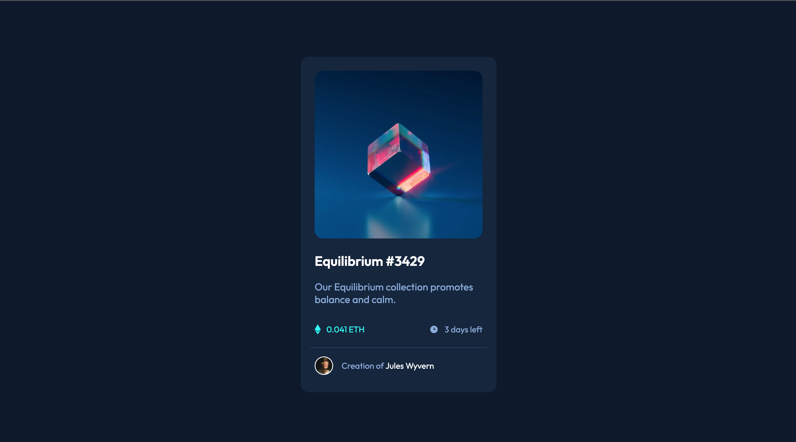

# Frontend Mentor - NFT preview card component solution

This is a solution to the [NFT preview card component challenge on Frontend Mentor](https://www.frontendmentor.io/challenges/nft-preview-card-component-SbdUL_w0U). Frontend Mentor challenges help you improve your coding skills by building realistic projects.

## Table of contents

- [Overview](#overview)
  - [The challenge](#the-challenge)
  - [Screenshot](#screenshot)
  - [Links](#links)
- [My process](#my-process)
  - [Built with](#built-with)
  - [What I learned](#what-i-learned)
  - [Useful resources](#useful-resources)
- [Author](#author)

## Overview

### The challenge

Users should be able to:

- View the optimal layout depending on their device's screen size
- See hover states for interactive elements

### Screenshot




### Links

- Solution URL: [Github Code](https://github.com/naathcs/NFT-preview-card)
- Live Site URL: [Pages preview](https://naathcs.github.io/NFT-preview-card/)

## My process

I started creating a repository on Github and then moved to the folder with everything I would need to tart this challenges.
Set up the HTML was the easiest part since I visualized everything that would be necessary to write down and eventually be used in CSS.

After writing the basics of CSS, I ended up getting stuck several times and started over the whole process of the challenge, which took me way to more time to solve the problem when I could simply restart the CSS file.

Using Flexbox again was also a bit challenging since it was not working as I was expecting but after watching and rewatching a tutorial to understand the concept I believe I was able to properly use it in some areas.

My biggest struggles were with the `:hover` and `overlay` CSS elements, along with positioning the `icon-view.svg` on the image so it would properly show up when you hover through the image.

Added anchor on every `:hover` element to be an interact card. The image will open once its clicked. The title will send the user to the frontendmentor Website. The creator name will send the user to the NFT card challenge page. Every anchor will open in a new tab so the user doesn't lose the main card that it is interacting with.

I also started a timer on my phone to see how long it would take for me to finish this project as a whole. Whenever I wasn't coding I paused the timer so it would be as accurate as possible. Also, the timer was used during the editing of the README file.

- Total time: `5h34m10s`

### Built with

- Semantic HTML5 markup
- CSS custom properties
- Flexbox
- Overlay

### What I learned

I learned to use overlay on a image and also had the change to practice more the Flexbox layout.
After trying to build the "perfect layout" I decided to take another approach and see the problem from a different angle. This helped understand the situation from a new point a view and find the solution much faster.

Knowing how to do research is also a big part of coding, and this helped a lot during the process. Sometimes I'd forget simples elements such as how to set up a border. But also I made researches about things I am learning and checked several different sources to better understand the code I was creating.

Below is part of the CSS I used for the `overlay` effect:


```css
.overlay {
  position: absolute;
  top: 0;
  left: 0;
  width: 100%;
  height: 100%;
  background: rgba(0, 255, 247, 0.6);
  display: flex;
  opacity: 0;
  border-radius: 15px;
}
.icon {
  height: 50px;
  width: 50px;
  margin: auto;
}
.image:hover .overlay {
  opacity: 1;
}
```
After writing this and seeing it working, it gave me truly joy to be able to finish this challenge.

Also, after the overlay was done, I added anchor in every `:hover` effect so the user can interact with the card.


### Useful resources

- [Mobile-first Workflow](https://www.freecodecamp.org/news/taking-the-right-approach-to-responsive-web-design/#:~:text=Mobile%2Dfirst%20is%20when%20we,styling%20for%20larger%20screen%20sizes.&text=In%20that%20example%2C%20for%20small,re%20simply%20applying%20some%20padding.) - Reading this helped to set the proper width for the final product.
- [hsl to hex Color Conversion](https://htmlcolors.com/hsl-to-hex) - I decided to use hexadecimal values for this challenge so I converted all the values provided in the `style-guide.md` file.
- [Flexbox Tutorial (CSS)](https://www.youtube.com/watch?v=k32voqQhODc&t=1416s) - I watched this simple tutorial several times to understand the simple concept of using flexbox in CSS.
- [Overlay Explained](https://www.youtube.com/watch?v=exb2ab72Xhs&t=394s) - I used this video to visually understand the overlay usage and it turns out to be easier than expected.


## Author

- Website - [Github](https://www.your-site.com)
- Frontend Mentor - [@naathcs](https://www.frontendmentor.io/profile/naathcs)
- Instagram - [@naath.cs](https://www.instagram.com/naath.cs)
